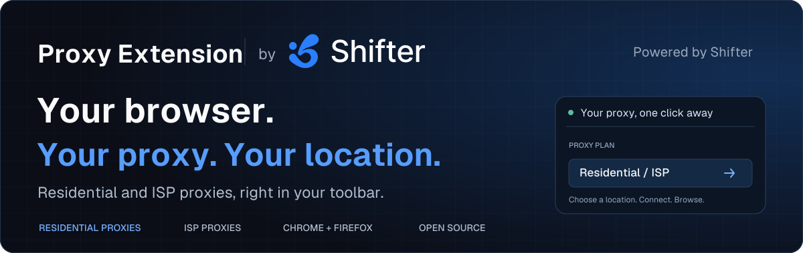

<p align="center">
  <a href="https://shifter.io/?utm_source=github&amp;utm_medium=referral&amp;utm_campaign=proxy_extension&amp;utm_content=readme_header">
    
  </a>
</p>

<h1 align="center">Residential &amp; ISP Proxy Browser Extension</h1>

<p align="center">
  Your browser. Your proxy. Your location.<br>
  <strong>Chrome and Firefox. Residential and ISP proxies. One-click connection.</strong>
</p>

<p align="center">
  <a href="#install-the-proxy-extension">Install</a> ·
  <a href="#why-shifter-proxy-extension">Features</a> ·
  <a href="#residential-proxies-and-isp-proxies">Residential &amp; ISP</a> ·
  <a href="https://ip-info.com/?utm_source=github&amp;utm_medium=referral&amp;utm_campaign=proxy_extension&amp;utm_content=readme_nav_lookup">IP Lookup</a> ·
  <a href="https://shifter.io/docs?utm_source=github&amp;utm_medium=referral&amp;utm_campaign=proxy_extension&amp;utm_content=readme_nav_docs">Shifter Docs</a>
</p>

**Shifter Proxy Extension** connects your browser to [Shifter Residential Proxies](https://shifter.io/services/residential-proxies?utm_source=github&utm_medium=referral&utm_campaign=proxy_extension&utm_content=readme_intro_residential) and [ISP Proxies](https://shifter.io/services/isp-proxies?utm_source=github&utm_medium=referral&utm_campaign=proxy_extension&utm_content=readme_intro_isp). Select a proxy plan, choose a location or an available ISP proxy, and connect from your browser toolbar. See your exit IP, manage sticky or rotating residential sessions, and switch locations without manually editing browser proxy settings.

The extension source is free under the MIT license. **Live proxy connections require a Shifter account, an API key, and an active supported proxy plan.** This is a browser proxy manager, not a device-wide VPN. Traffic from other applications is not routed through the extension.

## Contents

- [Why Shifter Proxy Extension?](#why-shifter-proxy-extension)
- [Install the proxy extension](#install-the-proxy-extension)
- [Connect your browser to a proxy](#connect-your-browser-to-a-proxy)
- [Residential proxies and ISP proxies](#residential-proxies-and-isp-proxies)
- [Proxy workflows for SEO and website testing](#proxy-workflows-for-seo-and-website-testing)
- [Check your proxy exit IP](#check-your-proxy-exit-ip)
- [Browser support and connection limits](#browser-support-and-connection-limits)
- [Privacy and browser permissions](#privacy-and-browser-permissions)
- [About Shifter and its products](#about-shifter-and-its-products)
- [Development](#development)
- [FAQ](#faq)
- [Contributing and support](#contributing-and-support)
- [License](#license)

## Why Shifter Proxy Extension?

Review a localized storefront, check how a page responds from another country, or keep a browsing session on a selected proxy. Shifter puts the proxy controls beside your address bar, with your existing Residential and ISP plans in one place.

| Capability | What it helps you do |
| --- | --- |
| **One-click proxy connection** | Connect or disconnect the browser from the toolbar. |
| **Residential proxy locations** | Choose country, state, city, and ASN where your plan supports those targeting levels. |
| **ISP proxy selection** | Browse the ISP proxies assigned to your plan, grouped by location and network. |
| **Sticky and rotating sessions** | Keep a residential session for a chosen duration or rotate without a sticky session identifier. |
| **New IP control** | Start a new residential session without re-entering your account details. |
| **Exit IP and connection status** | See the observed proxy IP, country, connection time, and toolbar status. |
| **Plan visibility** | Check traffic allowance, plan status, and renewal or expiry information. |
| **Connection settings** | Configure entry points, strict location targeting, WebRTC protection, and proxy bypass rules. |
| **Inspectable source** | Review the browser permissions, API client, proxy controller, and local tests. |

Location availability and session controls depend on your plan. Changing proxy credentials can require a browser restart; see [connection limits](#browser-support-and-connection-limits).

## Install the proxy extension

Build from source with **Node.js 24 and npm**. A normal build uses the bundled assets and location catalog; no private datasets or infrastructure repositories are needed.

```sh
git clone https://github.com/shifter-io/proxy-extension.git
cd proxy-extension
npm ci
npm run build
```

### Chrome, Brave, and Microsoft Edge

1. Open the browser's extensions page: `chrome://extensions`, `brave://extensions`, or `edge://extensions`.
2. Enable **Developer mode**.
3. Select **Load unpacked** and choose `build/chrome-mv3`.
4. Pin **Shifter — Proxy & VPN** to the toolbar, then open it.

The Chromium build uses Manifest V3. Chrome is covered by the automated browser suite; Edge and Brave use the same extension APIs but are not independently covered by that suite.

### Firefox

```sh
npm run build:firefox
```

Open `about:debugging#/runtime/this-firefox`, select **Load Temporary Add-on**, and choose `build/firefox-mv2/manifest.json`. Temporary installations are removed when Firefox restarts. Standard persistent Firefox installations require a signed package. The manifest requires Firefox 140 or later on desktop.

[Build and packaging instructions](BUILD.html) cover production archives and reviewer sources. Store publication and signing are separate from these local builds.

## Connect your browser to a proxy

1. Sign in to your [Shifter account](https://shifter.io/login?utm_source=github&utm_medium=referral&utm_campaign=proxy_extension&utm_content=readme_signin) and copy your API key from **Profile → API Key**.
2. Paste the key into the extension. It verifies the key and loads your supported plans.
3. Choose a Residential or ISP proxy plan. A single usable plan opens directly.
4. For Residential, select a supported location and session mode. For ISP, choose an assigned proxy.
5. Select **Connect** and check the exit IP shown in the popup.

Use **Disconnect** to clear the extension's proxy configuration. To remove the stored API key, sign out from Settings. Do not share your key, account screenshots, or proxy credentials in GitHub issues.

## Residential proxies and ISP proxies

| | Residential proxies | ISP proxies |
| --- | --- | --- |
| **Selection** | Country, state, city, and ASN where supported by the plan. | A proxy assigned to your plan, selected from the location and network list. |
| **Sessions** | Sticky sessions with a configurable duration, or rotating mode. | Uses the selected proxy's assigned credentials. |
| **Switching** | Change targeting or select New IP to request a new session. | Select another available ISP proxy. |
| **Useful for** | Regional browsing checks, localization reviews, and comparing website behavior across markets. | Browsing workflows that need a selected ISP proxy and location. |

Residential plans expose different targeting scopes: **Full Geo** supports country, state, city, and ASN; **Country Geo** supports country selection; **Non-Geo** does not expose location targeting. The extension follows those plan capabilities. Legacy Static Residential plans and other product lines without supported gateway credentials are not listed.

A sticky session requests continuity for its configured duration; it does not guarantee that an exit IP will remain available indefinitely. ISP proxy switching is subject to the browser's credential cache, described below.

## Proxy workflows for SEO and website testing

- **Regional SEO checks.** Inspect localized search pages and landing pages from a selected market. Results may still depend on language, account state, cookies, and search-engine personalization.
- **Website localization QA.** Compare language, currency, redirects, and regional content on your own website.
- **Storefront and price checks.** Review how your public product pages and offers appear through different residential locations.
- **Ad verification.** Inspect your own campaigns and landing pages from an available country or network.
- **Connection troubleshooting.** Compare direct browsing with a proxy connection and verify the observed exit IP.

This extension is intended for interactive browser use. For automated rank tracking, structured search data, or programmatic web scraping, see Shifter's APIs below.

## Check your proxy exit IP

The extension uses [IP Info](https://ip-info.com/?utm_source=github&utm_medium=referral&utm_campaign=proxy_extension&utm_content=readme_exit_ip) to display the IP and country observed through your proxy connection. You can also open IP Info in a proxied browser tab to inspect the reported ASN and network details.

An exit-IP lookup describes the connection observed by that request. IP geolocation is approximate, and a lookup alone does not prove anonymity or whether an address is residential. With rotating sessions, a later request can use a different exit.

## Browser support and connection limits

| Browser | Build | Coverage |
| --- | --- | --- |
| Chrome | `build/chrome-mv3` | Automated Chrome for Testing suite. |
| Brave and Microsoft Edge | `build/chrome-mv3` | Chromium-compatible build; not independently tested in these browsers. |
| Firefox 140+ | `build/firefox-mv2` | Automated Firefox suite. |
| Safari | Not provided | This project does not include a Safari build. |

Browsers cache proxy credentials and keep existing connections alive. The extension uses available gateway hostname and port combinations to apply changed credentials. When those combinations are exhausted, Chrome requests a browser restart. Firefox can retain a previous proxy login until restart. Pinning an entry point reduces the available combinations; ISP plans with one gateway address are especially affected when switching usernames.

The extension does not clear website cookies when connecting, switching, or disconnecting. It also does not provide a device-wide kill switch. A failed initial exit-IP check clears the proxy configuration; a failed periodic check retains the last displayed IP.

## Privacy and browser permissions

Your API key is stored in the extension's local browser storage and sent to Shifter to authenticate account requests. Proxy credentials are used to authenticate the selected gateway. Local browser storage is not an encrypted credential vault. The extension contains no analytics SDK or bundled customer credentials.

| Permission | Why it is requested |
| --- | --- |
| `proxy` | Apply or clear the browser proxy configuration. |
| `storage` | Keep the API session, settings, selected locations, and connection state locally. |
| `webRequest` and proxy-auth permission | Answer proxy authentication challenges. Chrome uses `webRequestAuthProvider`; Firefox uses `webRequestBlocking`. |
| `privacy` | Apply WebRTC protection while connected. |
| `alarms` | Schedule gateway latency checks. |
| Host access, including `<all_urls>` | Authenticate proxy traffic to arbitrary websites and perform the IP check; access to Shifter supports account API calls. |

Local destinations and Shifter's account/API domains bypass the proxy by default. You can add bypass rules in Settings. WebRTC protection reduces one source of direct network exposure; it is not an anonymity guarantee. Signed-in websites can still recognize your account and information you provide.

## About Shifter and its products

[Shifter](https://shifter.io/?utm_source=github&utm_medium=referral&utm_campaign=proxy_extension&utm_content=readme_about_shifter) builds proxy infrastructure and web data APIs for developers, data teams, and businesses. Its products support web scraping, SEO monitoring, ad verification, price intelligence, and AI data workflows.

| Product | What it offers | Useful for |
| --- | --- | --- |
| [**Residential Proxies**](https://shifter.io/services/residential-proxies?utm_source=github&utm_medium=referral&utm_campaign=proxy_extension&utm_content=readme_residential_proxies) | Residential proxy access with geo targeting, rotation, and sticky sessions. | Localized browsing, scraping, and distributed data collection. |
| [**ISP Proxies**](https://shifter.io/services/isp-proxies?utm_source=github&utm_medium=referral&utm_campaign=proxy_extension&utm_content=readme_isp_proxies) | ISP proxy plans with assigned locations and networks. | Workflows that need a selected proxy endpoint. |
| [**Web Scraping API**](https://shifter.io/services/scraping-api?utm_source=github&utm_medium=referral&utm_campaign=proxy_extension&utm_content=readme_scraping_api) | Managed web content retrieval with proxy handling and rendering options. | Programmatic page collection. |
| [**SERP API**](https://shifter.io/services/serp-api?utm_source=github&utm_medium=referral&utm_campaign=proxy_extension&utm_content=readme_serp_api) | Structured search engine results through an API. | Rank tracking, keyword research, and search data pipelines. |

[Explore Shifter](https://shifter.io/?utm_source=github&utm_medium=referral&utm_campaign=proxy_extension&utm_content=readme_shifter_cta) · [View pricing](https://shifter.io/pricing?utm_source=github&utm_medium=referral&utm_campaign=proxy_extension&utm_content=readme_pricing) · [Read the documentation](https://shifter.io/docs?utm_source=github&utm_medium=referral&utm_campaign=proxy_extension&utm_content=readme_shifter_docs)

For a quick check without installing an extension, try the [Free Web Proxy](https://shifter.io/web-proxy?utm_source=github&utm_medium=referral&utm_campaign=proxy_extension&utm_content=readme_web_proxy). Its companion repository is [shifter-io/web-proxy](https://github.com/shifter-io/web-proxy). The [shifter-io/ip-info](https://github.com/shifter-io/ip-info) project provides the IP lookup service used by this extension.

## Development

Built with WXT, React, TypeScript, and Tailwind CSS. The browser popup and background controller share typed account and proxy state.

```sh
npm ci
npm run dev             # Chromium extension with live reload
npm run dev:firefox     # Firefox development
npm run compile        # TypeScript check
npm run build          # Production Chromium build
npm run build:firefox   # Production Firefox build
npm run zip            # Chromium package
npm run zip:firefox     # Firefox package
```

### Preview without an account

```sh
npm run preview:ui
```

Open `http://localhost:4178/popup.html`. The preview uses synthetic account data and simulated proxy connections; it does not route your browser traffic. Add `?reset` to clear preview state, or `?demo` to open a signed-in mock plan. Do not enter a real API key into the mock preview.

Mock keys contain at least 32 letters or digits. Prefix a key with `single`, `country`, `nongeo`, `isp`, `none`, or `invalid` to exercise the corresponding plan or error scenario. All mock exit IPs use documentation-only address space.

### End-to-end checks

```sh
cd e2e
npm ci
npm test -- --offline
```

The test suite runs Chrome for Testing and Firefox against a synthetic Shifter API and local proxy gateway. The offline option skips the real-service invalid-key check. Test builds use separate output directories. See the [test guide](docs/testing.html).

| Directory | Contents |
| --- | --- |
| `src/entrypoints/` | Popup entry point and background worker. |
| `src/lib/api/` | Live Shifter API client and synthetic mock backend. |
| `src/lib/proxy/` | Gateway selection, proxy authentication, bypass rules, and session usernames. |
| `src/lib/geo/` | Bundled country, region, city, and ASN catalog. |
| `src/ui/` | Screens, shared components, and application state. |
| `e2e/` | Browser drivers, synthetic API, local gateway, and integration checks. |
| `scripts/` | Build helpers, local preview, and documentation generators. |
| `docs/` | Standalone HTML guides and the README banner. |

The checked-in catalog contains location and ASN labels, not customer IPs or raw inventory exports. Regenerating it is a maintainer task requiring authorized input data; it is not part of the normal build. The [API integration reference](docs/api.html) uses synthetic account examples.

Run `python3 scripts/render-readme.py` after editing the README or reference documents to refresh the [offline documentation](docs/readme.html). The banner generator uses the bundled Geist font; optional `fonttools` and `brotli` packages are needed only when regenerating the banner.

## FAQ

### Is this a free proxy extension?

The extension's source code is free under MIT. Actual Residential and ISP proxy traffic requires an active Shifter plan. The mock preview works without an account but does not provide a working proxy connection.

### Can I use residential proxies in Chrome and Firefox?

Yes. Install the matching build, sign in with your Shifter API key, choose a supported Residential plan, and select the available targeting and session options.

### Does it support ISP proxies?

Yes. Supported ISP plans expose a list of assigned proxies. Select an entry to use its gateway credentials. Some username changes require a browser restart because browsers cache proxy authentication.

### Is this a VPN for my whole device?

No. It controls this browser's proxy settings. Other applications, other browser profiles, and bypassed destinations are outside that configuration.

### Can I import any proxy list or use another provider?

Not currently. This extension integrates with Shifter accounts, plan capabilities, and gateway credentials. It is not a generic proxy-list importer.

### Can a residential proxy extension help with SEO checks?

It can help you inspect localized search pages and website content from a selected proxy location. Cookies, account state, language, and personalization still influence results. Use a SERP API when you need structured or repeatable rank-tracking data.

### Will changing locations log me out of websites?

The extension does not delete cookies. A website may still require another sign-in or verification when it sees a different network or location.

## Contributing and support

Bug reports, documentation improvements, and pull requests are welcome at [shifter-io/proxy-extension](https://github.com/shifter-io/proxy-extension). Include reproduction steps, browser version, and expected behavior. Run the relevant checks before submitting a change.

Use [Shifter's support resources](https://shifter.io/docs?utm_source=github&utm_medium=referral&utm_campaign=proxy_extension&utm_content=readme_support) for account and service questions. Remove API keys, proxy passwords, personal account details, IP addresses, and browsing history from public reports.

If this project helps your workflow, star the repository or share it with someone who needs a Residential or ISP proxy browser extension.

## License

Project source is released under the [MIT License](LICENSE). Third-party dependencies, fonts, and assets retain their own licenses. Shifter branding retains its respective rights. See [third-party asset notices](docs/third-party-notices.html).
